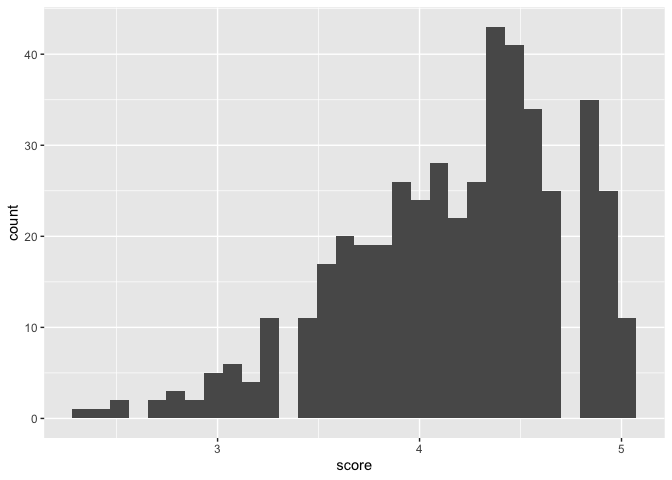
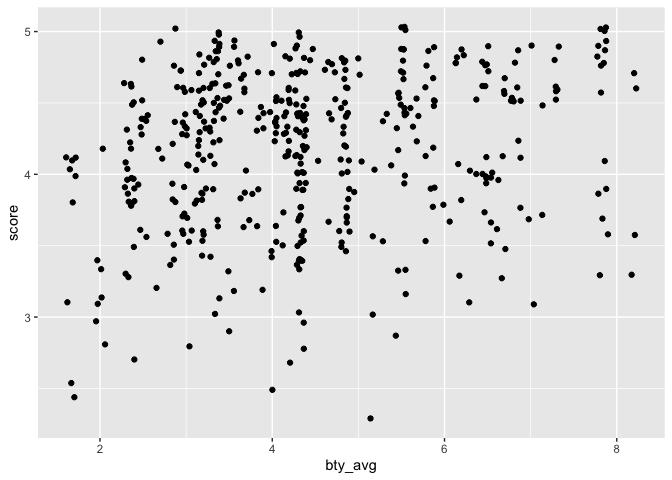
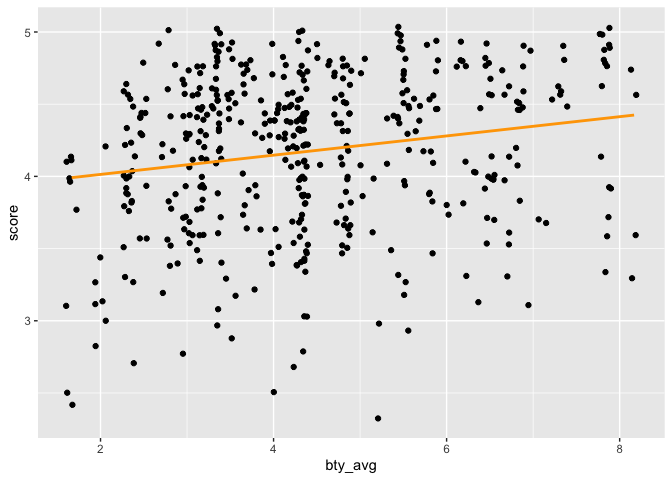

Lab 10 - Grading the professor, Pt. 1
================
Olivia Zhang
5/14/2025

## Load Packages and Data

``` r
library(tidyverse) 
library(tidymodels)
library(openintro)
library(broom)
```

## Exercise 1

``` r
evals %>%
  ggplot(aes(x = score)) +
  geom_histogram()
```

    ## `stat_bin()` using `bins = 30`. Pick better value with `binwidth`.

<!-- -->

``` r
mean(evals$score)
```

    ## [1] 4.17473

The distribution of score is skewed to the left, which means students
tend to rats their courses pretty high (M = 4.17). It is expected
because many students do not want to rate their professors/course bad
even if they think the courses need improvement.

## Exercise 2

``` r
evals %>%
  ggplot(aes(x = bty_avg, y = score)) +
  geom_point()
```

<!-- -->

It seems most courses are taught by low to average looking professors
who have good evals. However, better looking professors tend to have
less bad evals.

## Exercise 3

``` r
evals %>%
  ggplot(aes(x = bty_avg, y = score)) +
  geom_jitter()
```

<!-- -->

Jittering seperates dots that overlap with each other, making the
distribution more representative of all data points. The trend obversed
in the original version is more clearly displayed in this version. That
is, most courses are taught by average looking professors and have
medium to good evals.

## Exercise 4

``` r
m_bty <- linear_reg() %>%
  set_engine("lm") %>%
  fit(score ~ bty_avg, data = evals)
tidy(m_bty)
```

    ## # A tibble: 2 × 5
    ##   term        estimate std.error statistic   p.value
    ##   <chr>          <dbl>     <dbl>     <dbl>     <dbl>
    ## 1 (Intercept)   3.88      0.0761     51.0  1.56e-191
    ## 2 bty_avg       0.0666    0.0163      4.09 5.08e-  5

The linear model predicting average professor evaluation score from
average beauty rating is: score = 3.88 + 0.0666\*bty_avg

## Exercise 5

``` r
evals %>%
  ggplot(aes(x = bty_avg, y = score)) +
  geom_jitter() +
  geom_smooth(method = "lm", color = "orange", se = FALSE)
```

    ## `geom_smooth()` using formula = 'y ~ x'

<!-- -->

The shading represents standard error, turning it off makes the trend
more visable and the plot cleaner.

## Exercise 6

The slope tells us that evaluation scores increase with beauty ratings.
Specifically, as beauty rate increases 1 unit, course evaluation
increases 0.0666.

## Exercise 7

The intercept represents the evaluation score when the professor’s
beauty rating is 0. It is just a mathematical artifact because a beauty
rating of 0 doesn’t mean anything (no one has a beauty rating of 0).

## Exercise 8

``` r
glance(m_bty)$r.squared
```

    ## [1] 0.03502226

The R2 of this model is 0.04, which means 4% of variance in the
evaluation scores is explained by professors’ beauty ratings.

## Exercise 9

``` r
m_gen <- lm(score ~ gender, data = evals)
tidy(m_gen)
```

    ## # A tibble: 2 × 5
    ##   term        estimate std.error statistic p.value
    ##   <chr>          <dbl>     <dbl>     <dbl>   <dbl>
    ## 1 (Intercept)    4.09     0.0387    106.   0      
    ## 2 gendermale     0.142    0.0508      2.78 0.00558

The reference level is female. The slope coefficient indicates that male
professors are evaluated 0.142 unit higher than female professors.

## Exercise 10

The equation of the line for male professors is: score = 4.09 + 0.142;
and the equation for female professors is: score = 4.09.

## Exercise 11

``` r
m_rank <- linear_reg() %>%
  set_engine("lm") %>%
  fit(score ~ rank, data = evals)
tidy(m_rank)
```

    ## # A tibble: 3 × 5
    ##   term             estimate std.error statistic   p.value
    ##   <chr>               <dbl>     <dbl>     <dbl>     <dbl>
    ## 1 (Intercept)         4.28     0.0537     79.9  1.02e-271
    ## 2 ranktenure track   -0.130    0.0748     -1.73 8.37e-  2
    ## 3 ranktenured        -0.145    0.0636     -2.28 2.28e-  2

Linear model predicting eval score from rank: score = 4.28 -
0.13*TenureTrack - 0.145*Tenured

The intercept indicates that for teaching professors, the average eval
score is 4.28. The eval score is 0.130 unit less for tenure track
professors and 0.145 unit less for tenured professors compared to
teaching professors.

## Exercise 12

``` r
evals$rank_relevel <- relevel(evals$rank, ref = "tenure track")
```

## Exercise 13

``` r
m_rank_relevel <- linear_reg() %>%
  set_engine("lm") %>%
  fit(score ~ rank_relevel, data = evals)
tidy(m_rank_relevel)
```

    ## # A tibble: 3 × 5
    ##   term                 estimate std.error statistic   p.value
    ##   <chr>                   <dbl>     <dbl>     <dbl>     <dbl>
    ## 1 (Intercept)            4.15      0.0521    79.7   2.58e-271
    ## 2 rank_relevelteaching   0.130     0.0748     1.73  8.37e-  2
    ## 3 rank_releveltenured   -0.0155    0.0623    -0.249 8.04e-  1

``` r
glance(m_rank_relevel)$r.squared
```

    ## [1] 0.01162894

Linear model predicting eval score from rank_relevel: score = 4.15 +
0.13*Teaching - 0.0155*Tenured

The intercept indicates that for tenure track professors, the average
eval score is 4.15. The eval score is 0.130 unit more for teaching
professors and 0.0155 unit less for tenured professors compared to
tenure track professors.

R2 of this model is 0.01, which means that rank explains 1% of variance
in the evaluation scores.

## Exercise 14

``` r
evals$tenure_eligible <- ifelse(evals$rank == "teaching", "no", "yes")
```

## Exercise 15

``` r
m_tenure_eligible <- linear_reg() %>%
  set_engine("lm") %>%
  fit(score ~ tenure_eligible, data = evals)
tidy(m_tenure_eligible)
```

    ## # A tibble: 2 × 5
    ##   term               estimate std.error statistic   p.value
    ##   <chr>                 <dbl>     <dbl>     <dbl>     <dbl>
    ## 1 (Intercept)           4.28     0.0536     79.9  2.72e-272
    ## 2 tenure_eligibleyes   -0.141    0.0607     -2.32 2.10e-  2

``` r
glance(m_tenure_eligible)$r.squared
```

    ## [1] 0.01149589

Linear model predicting eval score from tenure_eligibleness: score =
4.28 - 0.141\*tenure_eligible

The intercept indicates that for teaching professors, the average eval
score is 4.28. The eval score is 0.141 unit less for tenure eligible
professors.

R2 of this model is 0.01, which means that whether a professor is tenure
eligible explains 1% of variance in the evaluation scores.
